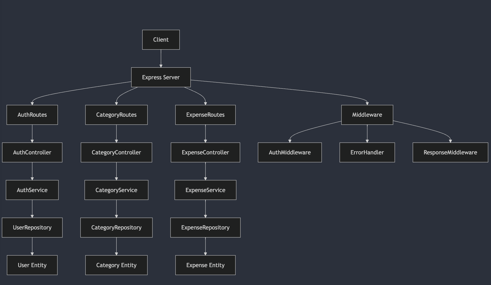

# Personal Expense Tracker Backend

This document outlines the architecture of a Node.js application built with Express, TypeORM, and TypeDI. It includes an explanation of each folder and file, along with a visual diagram of the architecture using Mermaid.js.

## Table of Contents

1. [Overview](#overview)
2. [Folder Structure](#folder-structure)
3. [Detailed Explanation](#detailed-explanation)
4. [Architecture Diagram](#architecture-diagram)

## Overview

This application is designed to manage expenses with features for user authentication, expense tracking, and category management. It leverages the following technologies:

- **Express**: A web application framework for Node.js.
- **TypeORM**: An ORM (Object-Relational Mapping) library for TypeScript and JavaScript.
- **TypeDI**: A dependency injection library for TypeScript and JavaScript.

## Folder Structure

```plaintext
src
├── config
│   ├── database.ts
│   ├── dotenv.ts
│   └── logger.ts
├── controllers
│   ├── CategoryController.ts
│   └── ExpenseController.ts
├── entities
│   ├── Category.ts
│   └── Expense.ts
├── middleware
│   ├── ErrorHandler.ts
│   └── ResponseMiddleware.ts
├── repositories
│   ├── BaseRepository.ts
│   ├── CategoryRepository.ts
│   └── ExpenseRepository.ts
├── routes
│   ├── ReportRoutes.ts
│   ├── CategoryRoutes.ts
│   └── ExpenseRoutes.ts
├── services
│   ├── ReportService.ts
│   ├── CategoryService.ts
│   └── ExpenseService.ts
├── validations
│   └── Expense.ts
└── index.ts
```

## Detailed Explanation

### Config

- **`database.ts`**: Manages the connection to the database using TypeORM.
- **`dotenv.ts`**: Loads environment variables from a `.env` file.
- **`logger.ts`**: Configures the Winston logger for logging messages to the console and a file.

### Controllers

- **`ReportController.ts`**: Handles authentication-related HTTP requests (e.g., login, register).
- **`CategoryController.ts`**: Manages HTTP requests for category operations (e.g., create, list).
- **`ExpenseController.ts`**: Handles HTTP requests for expense operations (e.g., create, list).

### Entities

- **`Category.ts`**: Defines the `Category` entity with fields for name and description.
- **`Expense.ts`**: Defines the `Expense` entity with fields for amount, description, date, and relationships to `User` and `Category`.

### Middleware

- **`ErrorHandler.ts`**: Centralized error handling middleware for managing exceptions.
- **`ResponseMiddleware.ts`**: Formats API responses consistently.

### Repositories

- **`BaseRepository.ts`**: A generic repository providing common data access methods.
- **`CategoryRepository.ts`**: Manages data access for the `Category` entity.
- **`ExpenseRepository.ts`**: Manages data access for the `Expense` entity.

### Routes

- **`ReportRoutes.ts`**: Defines routes for authentication-related endpoints.
- **`CategoryRoutes.ts`**: Defines routes for category-related endpoints.
- **`ExpenseRoutes.ts`**: Defines routes for expense-related endpoints.

### Services

- **`ReportService.ts`**: Contains business logic for authentication processes.
- **`CategoryService.ts`**: Contains business logic for managing categories.
- **`ExpenseService.ts`**: Contains business logic for managing expenses.

### Validations

- **`Expense.ts`**: Defines Joi schemas for validating expense data.

### Entry Point

- **`index.ts`**: The main entry point for the application where the server is initialized and started.

## Architecture Diagram



Certainly! Below is a comprehensive `README.md` file that includes setup instructions and a brief overview of the application's functionality. Additionally, I'll provide an `ARCHITECTURE.md` file that contains an in-depth explanation of the architecture.

## Features

- User authentication (register and login)
- CRUD operations for expenses
- Categorize expenses
- Generate reports for expenses (daily, weekly, monthly, yearly)
- Dashboard for comparing expenses
- Swagger API documentation

## Getting Started

### Prerequisites

Ensure you have the following installed:

- Node.js (v14 or higher)
- npm

### Installation

1. **Clone the repository:**

   ```bash
   git clone https://github.com/parita-akoliya/personal-expense-tracker-backend.git
   cd personal-expense-tracker-backend
   ```

2. **Install dependencies:**

   ```bash
   npm install
   ```

3. **Setup environment variables:**

   Create a `.env` file in the root directory and add the following variables:

   ```plaintext
   DATABASE_URL=your_database_connection_url
   JWT_SECRET=your_jwt_secret
   LOG_LEVEL=info
   LOG_FILE_PATH=logs/app.log
   ```

4. **Run database migrations:**

   ```bash
   npm run typeorm migration:run
   ```

## Running the Application

1. **Start the server:**

   ```bash
   npm start
   ```

   The server will be running at `http://localhost:3000`.

2. **Access Swagger API documentation:**

   Visit `http://localhost:3000/api-docs` to view the API documentation.

## Testing

1. **Run tests:**

   ```bash
   npm test
   ```

   This will execute the unit tests using Jest.

## API Documentation

The API is documented using Swagger. To view the documentation, visit `http://localhost:3000/api-docs` after starting the server.
